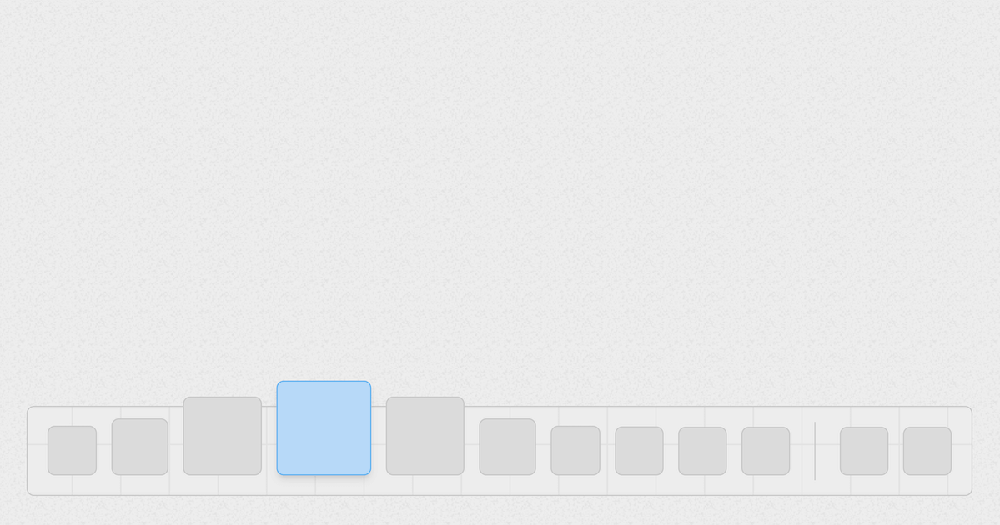

# Big Sur dock

Build a macOS Big Sur style dock with Next.js, react-use, Tailwind CSS and Framer Motion.



## Features

- Keyboard friendly.
- Accessibility friendly.

## Tech Stack

- [Next.js](https://nextjs.org/) - Framework.
- [react-use](https://github.com/streamich/react-use) - Hooks.
- [Tailwind CSS](https://tailwindcss.com/) - Styling.
- [Framer Motion](https://www.framer.com/motion/) - Animation.

## Run Locally

```bash
$ git clone https://github.com/untitled-lab/big-sur-dock.git
$ cd big-sur-dock
$ pnpm install
$ pnpm dev
```

## Acknowledgements

- Inspired by [Rauno Freiberg](https://twitter.com/raunofreiberg)'s website.
- Using [Austin Malerba](https://twitter.com/austin_malerba/status/1556678271374397440)'s codebase.
- Using [Not a Number](https://www.nan.fyi/)'s UI.

## License

[MIT](https://choosealicense.com/licenses/mit/)
